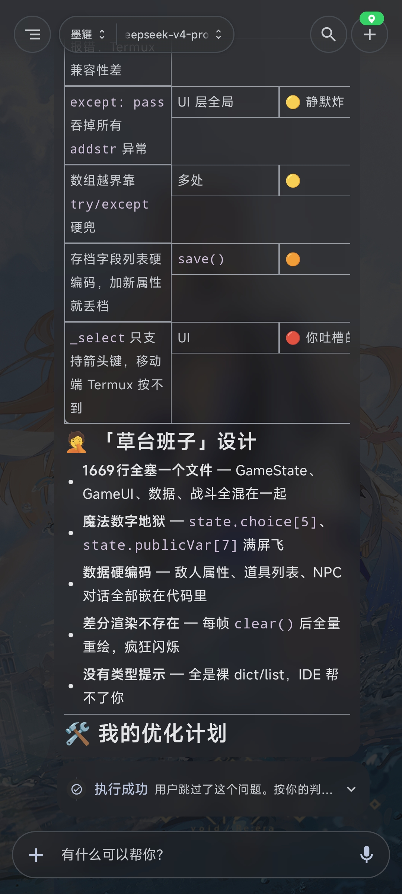
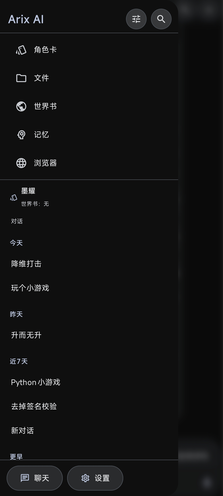
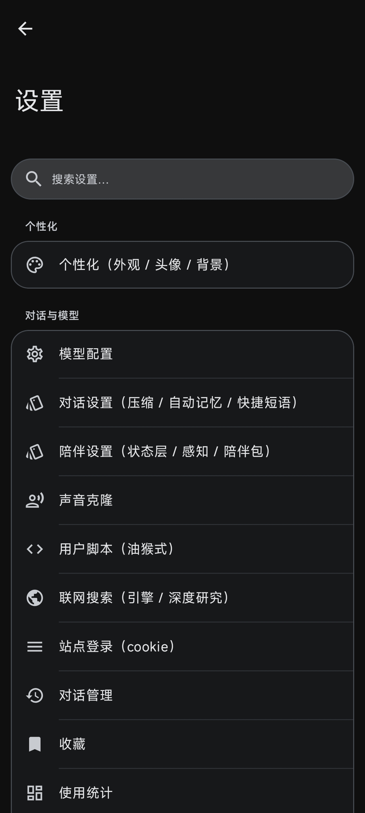
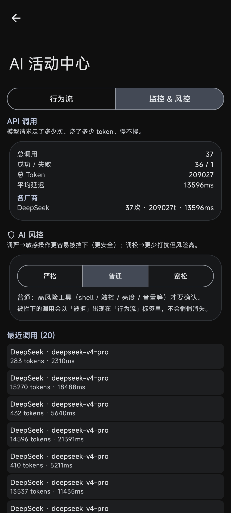
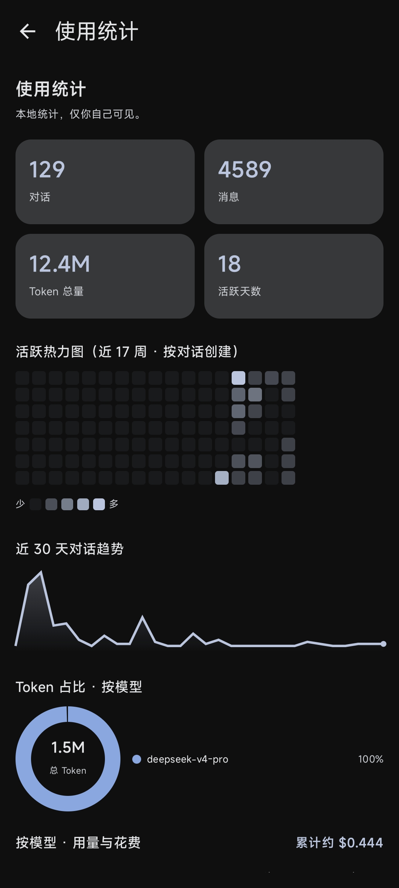

<div align="center">
  <span>中文</span> | <a href="README_EN.md">English</a>
</div>

<div align="center">
  
  
  
  
  <br>
  <a href="mailto:tomrz666@qq.com"></a>
  <a href="#-社群"></a>
  <a href="https://t.me/onyxui_project"></a>
  <a href="https://codeberg.org/OnyxUI"></a>
  <a href="../../issues"></a>
</div>

<div align="center">
  <h1>Arix — 手表上的语音 AI 助理</h1>
  <p>⌚ <b>抬起手腕说一句话，它听懂、动手、把事办了。76 个多用途工具，装在手表上，也装在手机上</b> ⌚</p>
  <p><b>出自 <a href="https://codeberg.org/OnyxUI">OnyxProject</a>，但不绑任何定制系统</b></p>
  <p><sub>OnyxUI 是一套面向手机与手表的轻量 Android 系统，Arix 是它的 AI 助理<br>
  但装 Arix <b>不需要</b> OnyxUI——任何 Android 8.0+ 的设备都能装</sub></p>
</div>

<div align="center">
  <div style="padding: 10px 0; text-align: center;">
    
    
    
    
    
  </div>
</div>

---

## 🌟 项目简介

**Arix** 不是又一个聊天框，是一个**以语音为第一入口**的 Android AI 助理。它能读日程和通知、
控制播放、跑 shell、查天气、搜网页、操作别的 App；带**长期记忆**与**记忆图谱**、**角色卡**
（兼容酒馆格式）、**工作流与 22 种设备事件触发**、**MCP 客户端与服务端**、以及一个**独立的完整
Linux 终端 App**。

工具只有 **76 个入口**，但每一个都是**多用途**的——这是刻意合并的结果，为的是不让模型在长列表里
选错工具（那是幻觉最常见的来源之一）。详见[下方说明](#🛠️-功能速览)。

### 它从哪来，又不绑在哪

**Arix 出自 [OnyxProject](https://codeberg.org/OnyxUI)**——
[OnyxUI](https://codeberg.org/OnyxUI/OnyxUI) 是一套面向手机与手表的轻量 Android 系统，
Arix 是它的 AI 助理，这个项目就是在那个生态里长出来的。

**但它不绑任何定制系统。** 不需要刷机、不需要 OnyxUI，**任何 Android 8.0+ 的设备都能装**——
原厂手表、普通手机都一样跑。生在 OnyxUI，不绑 OnyxUI。

刷了 OnyxUI 反而能多解锁一层：作为系统应用能拿到签名级权限，虚拟屏与后台自动化才用得上
（见应用内「能力等级」）。

### 名字的来历

本来打算叫 **OnyxAI**——跟着 OnyxUI 的名字走，最顺理成章。

后来发现 **Onyx 是别人的注册商标**。而这个项目当时正要往实机上装，名字一旦跟着出厂就改不动了，
所以赶在那之前换掉：**Arix**。

所以你在历史记录、旧备份、甚至本机目录名里还会看到 `onyx` 的痕迹——那是同一个项目改名前的样子，
不是另一个东西。改名时刻意留了兼容：旧版本导出的备份现在照样能恢复，库名与路径会自动映射过来。

⚠️ 顺带一句：**OnyxUI 与 OnyxProject 不在此列**——那是上游生态自己的名字，跟商标那件事无关，
所以它们保持原名，一个字没改。

> ⚠️ **状态：开发中，尚未发布。** 主要功能已可用，但**绝大部分改动只做过编译与单元测试验证，
> 真机覆盖率很低**；接口与数据格式仍会变动。现在不建议当日常工具依赖。

### 说句实在话

**这是我做的第一个项目。** 没有团队，也没受过工程规范的训练，所以很多地方大概是「能跑就先这样」——
主 App 基本是个单体、真机验证覆盖率很低、有些取舍现在回头看未必站得住。不足肯定不止我自己看见的这些。

**所以恳请各路高手直接指出来。** 架构、安全、性能、Android 平台的坑、哪段代码一看就外行——
什么都欢迎。开 [issue](../../issues)、在社群里说、或者直接发邮件都行。

说重一点没关系，我更怕的是它一直错着而没人告诉我。如果你顺手指出一个坑，
对这个项目的帮助会比我自己闷头写一星期大得多。

---

## ⚡ 核心亮点

<table>
<tr>
<td width="50%">

### ⌚ 为手表而做
抬腕门控 + 级联唤醒，**不常听麦克风**。自定义唤醒词可录多套模板分别启用。语音是第一入口而不是
附加功能，UI 从一开始就按方屏小尺寸设计——每一 mA 都算。

### 🧠 会攒经验的记忆
长期记忆库 + 力导向记忆图谱 + 向量检索，另有「交互状态层」让它开新对话时还像它自己。
**失败会沉淀成教训**：工具被拒、参数写错、内容被截断都记下来，下次那个工具的说明里就带着
「上回这么干不行」——模型在决定要不要调它的那一刻就看得到。

### 🐧 独立终端 App
完整 Linux 运行时（bash / coreutils / python3 / apt / curl），主 App 通过签名级权限绑它。
工作目录与 AI 的文件工作区一致，**AI 和你操作的是同一批文件**。

</td>
<td width="50%">

### 🔐 隐私当成需求做
单独一档**「隐私级」**权限：通讯录、短信、日历、通知、剪贴板、使用情况、整屏截图、身体传感器、
直接拨号——默认每次询问，**且永不交给模型自动审批**。另有**隐身取页**（独立进程、自带 cookie 库，
不带出登录态、不留痕迹）。

### 🎭 角色卡与陪伴
角色卡管理、世界书、可导入 SillyTavern（酒馆）格式——含多开场白、插在历史之后的越狱指令、
按深度插入的提示。陪伴层带情绪状态与日记。

### 🔌 三种协议 + 可扩展
**OpenAI 兼容**（绝大多数厂商与中转站）、**Anthropic 原生**、**Gemini 原生**。
MCP 客户端与服务端、第三方工具网关、JS 插件运行时（兼容 Operit 包生态）。
AI 也可以**自己装**技能/沙盒包/MCP——每次安装都要过用户审批。

</td>
</tr>
</table>

---

## 🛠️ 功能速览

> ### 📌 关于「只有 76 个工具」
>
> 这个数字**是刻意压下来的，不是没做完**。
>
> 工具表是每一轮都要发给模型的，而它越长、越碎，模型**选错工具的概率就越高**——
> 那是幻觉最常见的来源之一：面前摆着二十个名字相近的工具，它挑一个看起来对的，然后调错。
>
> 所以我们的做法是**「一个工具，多种用法」**：新能力优先合并成已有工具的一个参数，而不是新开一个。
> 举几个真实的例子——
>
> - `notification` 一个工具管完读通知 / 直接回复 / 按通知上的按钮 / 点开 / 清除 / 自己发一条
> - `open_page` 一个工具管完取正文 / 取原始 HTML / 解析 JSON / 抓图片 / 抓视频 / **隐身抓取**
> - `web_search` 把普通搜索和多轮深度研究合在一起，不拆成两个
> - `bluetooth` 一个工具覆盖 12 种动作（GATT + SPP），而不是十几个粒度化的蓝牙工具
> - `file_op` 一个工具管完复制 / 移动 / 删除 / 压缩 / 解压
>
> 换句话说：**能力条数远多于 76**，只是被收纳进了 76 个入口。
> 与其让模型在长列表里猜，不如让它在短列表里读参数。

<details>
<summary><b>📦 内置工具系统（76 个入口，点击展开）</b></summary>

| 工具类型 | 功能说明 |
|---------|---------|
| 🖥️ **系统操作** | 文件读写/编辑/压缩、shell、设备控制（亮度/音量/手电筒/WiFi）、装卸与强停应用、发送 Intent |
| 🔔 **通知与感知** | 读通知、直接回复通知、按通知上的按钮、使用情况统计、屏幕 OCR |
| 🌐 **网络** | HTTP 请求、网页抓取（**可隐身**）、搜索、深度研究（多轮）、GitHub、站点 Cookie |
| 📅 **生活** | 日程读写、通讯录、短信、天气、地图、火车票、闹钟与提醒、生活查询 |
| ❤️ **健康** | **现场测**心率/血氧（本机传感器优先，回落手表）、设备状态 |
| 🎬 **媒体** | 音乐控制、TTS、语音克隆、图片 OCR/裁剪、文档解析、生成 PDF/docx/图片 |
| 🤖 **进阶自动化** | UI 自动化、技能录制回放、Home Assistant、蓝牙（GATT + SPP）、子 agent、工作流 |
| 🧩 **扩展** | MCP 网关（`search_tool` / `use_tool`）、插件创建与安装、本地搜索、记忆读写 |

</details>

<details>
<summary><b>🗣️ 语音链路（点击展开）</b></summary>

- 🎙️ **自定义唤醒词**：可录多套模板，分别启用
- 🔋 **抬腕门控 + 级联唤醒**：不常听麦克风，先用极轻量的一级筛，再逐级确认
- 💬 **实时语音通话**：VAD 自动断句，可随时插话打断
- 🔊 **自动朗读**：可只念台词（跳过动作描写与旁白）
- 🎧 **耳机键唤起**：线控按键召出助手 —— 但**正在放歌时按线控是控制音乐，不抢**
- 📴 **本地优先**：唤醒与识别都在本机，离线可用

</details>

<details>
<summary><b>🧠 记忆与上下文（点击展开）</b></summary>

- 📚 **长期记忆库**：打分检索、时效与冲突消解、自动整理（拿不准的停下来问你）
- 🕸️ **力导向记忆图谱**：反向链接、未链接提及、标签、局部子图
- 🔍 **向量语义索引** + **跨对话全文检索**（FTS）
- 🎭 **交互状态层**：把「上次聊到哪 / 氛围 / 未决问题」带进新对话
- 📉 **上下文窗口感知**：估算这一轮塞了多少 token、离上限还有多远，逼近时自动压缩
- ✂️ **历史条数上限**：可配，且截断后一定修好工具调用的配对（否则接口直接报错）

</details>

<details>
<summary><b>🔐 隐私与权限（点击展开）</b></summary>

- 🚦 **三档策略**：允许 / 询问 / 禁止，**按调用方分别记**——给某个插件放行 shell，不等于给 AI 也放行
- 🕵️ **隐私级**：碰你个人数据的工具单独一档，默认询问、永不进模型自动审批
- 🗣️ **审批弹窗说人话**：讲清「这一步到底想干什么」，而不是甩一个工具名
- 👻 **隐身取页**：独立进程 + 自己的 cookie 库（需 Android 9+；做不到时**会明说，不会假装**）
- 📦 **沙箱**：AI 的私有工作区禁止逃逸；第三方包不能顶掉内置工具名
- 🔒 **备份可加密**：AES-GCM；敏感工具的结果不落库、也不进备份
- 🗑️ **卸载即撤权**：插件卸载会清掉它攒下的全部授权，防同名包重装静默继承

</details>

<details>
<summary><b>🎨 界面与个性化（点击展开）</b></summary>

- 🌈 **主题与配色**：动态取色（莫奈）、图片取色、多套预设、深浅色
- 💬 **聊天外观**：气泡形状/配色/透明度/尾巴、头像、密度、按行拆气泡
- ✨ **聊天特效**与一键皮肤、斜杠命令
- 🪟 **悬浮球 / 实时胶囊 / 超级岛**：不打开 App 也能用它
- 📐 **抽屉自定义**：全屏编辑器，拖拽排布约 26 个入口，三档大小
- 🌍 **33 种语言**，1927 条界面文案
- 📄 **Markdown 渲染**：LaTeX、代码高亮、表格、Mermaid、可嵌 SVG/音视频

</details>

<details>
<summary><b>💾 数据与备份（点击展开）</b></summary>

- 📦 **整包 zip 备份** + **GitHub 私有仓库** / WebDAV / S3 三通道
- 🔑 **AES-GCM 加密**，云端多版本
- 🔄 **兼容旧包数据**：从改名前的版本恢复时自动映射库名与路径
- 🔐 **密钥池**：多 key 轮换、健康档案（冷却/禁用跨重启存活）、余额查询

</details>

---

## 📲 上手

### 装

> ✅ **已在 GitHub Releases 发布**（[查看](../../releases)），最新稳定版是 **v0.2.2**。新版本也会在社群公告。

需要 **Android 8.0（API 26）以上**。打开后在设置里填一个 API key 就能用。

**体积**：release 包约 **42MB**。**不含终端的 Linux 环境**——那是独立 App，装了它才会再展开
约 130MB 的 bootstrap。只用对话与工具的话，42MB 就是全部。

> ⚠️ **认准官方渠道。** 本项目采用 AGPL-3.0，任何人都可以 fork 和二次开发——这是我们鼓励的。
> 但若有人把它改个名字当作自己的原创发布、或删掉署名，那既违反协议，也拿不到我们的更新与支持。

### 自己编

```bash
git clone https://github.com/XTOM0706/arix-app.git
cd arix-app
./gradlew :app:assembleDebug
# 产物：app/build/outputs/apk/debug/app-debug.apk
```

需要 **JDK 17** 与 Android SDK（`compileSdk 36`）。仓库自带 pre-commit 钩子，提交前会跑一遍编译。

**终端的 Linux 环境需额外一步**：它依赖 `bootstrap-<abi>.zip`——上百 MB 的构建产物，超了 GitHub
单文件上限，**没有入库**。不放它 App 照常跑，只是终端回退到 busybox。
见 [TERMUX-BOOTSTRAP-BUILD.md](TERMUX-BOOTSTRAP-BUILD.md)。

### 二次开发（改完不用重编库）

`app` 依赖的 4 个库模块（`wake` / `cloudapi` / `stt` / `data`）+ 纯 JVM 模块 `logic` 已经预编译好了——
Releases 里的 **`arix-prebuild-libs-0.2.2.zip`** 装着它们（AAR/JAR，含 `stt` 的 native 库）。

如果你**只改 `app` 模块**，用预编译库能跳过这些模块的整编（省下大部分编译时间）：

1. 下载 `arix-prebuild-libs-0.2.2.zip`，解压到 `app/libs/` 下；
2. 把 `app/build.gradle.kts` 里的 `implementation(project(":wake"))` 等 5 行换成对 AAR/JAR 的 `files()` 依赖；
3. 之后改 `app` 代码只增量编译，不再重编 `wake`/`cloudapi`/`stt`/`data`/`logic`。

⚠️ 如果你会改到库模块本身（比如动 `stt` 的模型加载逻辑），就别用预编译库，保持 `project(":...")` 依赖即可。
预编译包与当前 `app` 版本同源，但改库模块后必须回到源码编译才能生效。

---

## 💬 社群

Arix 与 OnyxUI **共用同一批社群**——它本来就是这个生态里的一个产物，没必要另起一摊。

| 渠道 | 地址 | 说明 |
|---|---|---|
| 🐧 **QQ 群** | **1063208484** | 主要阵地，中文，Arix 与 OnyxUI 都在这儿聊 |
| ✈️ **Telegram** | [@onyxui_project](https://t.me/onyxui_project) | OnyxProject 官方频道 |
| 🌍 **OnyxProject** | [codeberg.org/OnyxUI](https://codeberg.org/OnyxUI) | 上游生态，OnyxUI 系统本体在这里 |
| 📧 **邮箱** | [tomrz666@qq.com](mailto:tomrz666@qq.com) | 开发者 XTOM，私事/合作找这里 |
| 🐛 **Issues** | [提一个](../../issues) | Bug 与需求，请带设备型号与 Android 版本 |

> 发布地址会在 **QQ 群**与 **Telegram 频道**公告。除此之外的渠道都不是我们发的。

---

## 🤔 和同类比

同类里 **Operit AI 是功能超集**——这点没什么好含糊的，它比我们做得早、做得多，星标也远在我们之上。

**我们真正不一样的只有一条：这是给手表做的。** 抬腕门控、级联唤醒、不常听麦克风、每一 mA 都算——
这些约束别人不用背，我们必须背。

许可上也不一样：Arix 是**纯 AGPL-3.0，没有商业授权门槛**，公司用、超过 10 个人用、拿去做商业产品
都可以——只要你守 AGPL（改了开源、保留署名）。

想要功能最全，去用 Operit；想要干净的聊天客户端，去用 RikkaHub；想要跨平台，去用 Kelivo。
**想在手表上抬手说话——那是我们。**

> 这里不列逐项功能/星标/许可对照表。同类迭代很快，那种表格几周就过时，而写错别人的许可条款
> 是很不礼貌的事。想比较请直接看各自仓库。

---

## 🙏 致谢

Arix 不是凭空长出来的。

<details>
<summary><b>Operit AI 与它的云端包作者们（点击展开）</b></summary>

**Operit AI（@AAswordman）** 是这条路上的先行者。Arix 借鉴了它的许多实现思路，也**兼容它的包生态**
——我们把 Operit 的包转换成 Arix 包，让两边的创作者不用重做一遍。

更要谢的是 **Operit 云端包/脚本的作者们**。Arix 的不少功能，灵感来自读你们的包：

| 包 / 脚本 | 作者 |
|---|---|
| 世界书plus | @HateCandy |
| 记忆系统 | @jbzmm |
| Soundprint 声纹包 | @yuyixuanfu |
| WebDAV 备份同步 | @Mariomoprc |
| AI的电子嘴巴 | @FrancisVael |
| 传话筒 | @RaineIris |
| Conversation lock | @ruojie108 |
| MusicFree · JsxposedX 逆向工程工具集 | @178945123 |
| Linux 桥接 · 认知熔炉 Pro | @Karzzzzz520 |
| Sandbox Package 开发工具包 · 微信 iLink Bot | @g1776933879 |
| 长图OCR增强 | @yoyowong138 |
| 思维级联引擎 | @JIANGZHAOKUN1067517323 |
| 插件情景管理器 · 审核面板·AI 教学版 | @maylihaidong |
| 渡渡语音 | @do-do026 |
| Shizuku启动器 | @purelife3 |
| 快速下载器 | @Jianyin-Li |
| 智能路由助手 | @laobi465 |
| AgentsMail邮箱 | @sweetcni9-ui |
| Agnes 视频生成 | @YunXi-Aurora · @drzdtd |
| Android 全自动开发 Agent | @camillanapoles |
| 月之暗面搜索工具 | @3316891527 |
| 渲染/巡检等其余包 | @qtgf520 · @yanjun62 · @fuqun616-eng · @lyn2010526-stack |

> 名单出自 `OperitPackageMarket` / `OperitScriptMarket` 两个仓库的公开 issue，**只取了近期的一批，
> 肯定有遗漏**——我们并不在 Operit 社区活动，是照公开记录整理的。漏了谁、或不想被列上，
> 开 issue 或到社群说一声，立刻改。

</details>

**同类项目**：**RikkaHub**（干净克制的界面是我们的参照系）· **Kelivo**（跨平台形态与交互细节）·
**橘瓣 OrangeChat**（陪伴层的思路）。

**开源基石**：ONNX Runtime · sherpa-onnx · Silero VAD · microWakeWord · TensorFlow Lite ·
Termux · Jetpack Compose · Kotlin · OkHttp · Coil · JLaTeXMath——完整清单与各自许可见 [NOTICE](NOTICE)。

**关于借鉴的边界**：我们参考的是**思路**，不是源码。`wake/` 是 clean-room 重写，不含任何 GPL/LGPL
源码（见 [wake/NOTICE](wake/NOTICE)）。借鉴别人的想法要说出来，搬别人的代码要守协议——两件事我们都当真。

---

## 🧩 为什么本地不跑 LLM

目标硬件是 4GB RAM、Cortex-A55 四核 1.2GHz 的手表。塞得下一个量化小模型，但它的能力配不上
「助理」二字，还会把电吃光。

所以对话走云端，本地只留语音链路——那部分小、快、离线也能用。想离线对话可以通过 MCP 接外部推理服务。

走**原生协议**（Anthropic / Gemini）而不是一律套 OpenAI 兼容层，是为了拿到兼容层给不了的东西：
思考签名的回传、提示缓存、各家专有的思考预算参数。

---

## 🏗️ 代码结构

431 个 Kotlin 文件，约 148k 行。实话实说：**主 App 基本上是个单体**，`:app` 一个模块占了 82%。

```
:app               121.5k 行  主应用：Compose UI、76 个工具、记忆、角色卡、MCP、插件运行时
:terminal           16.6k 行  独立终端 App（proot + 完整 Linux 环境）
:cloudapi            3.3k 行  云端 AI 客户端（三种协议 + SSE 流式）
:wake                2.4k 行  语音唤醒（SileroVAD + MFCC + DTW + KWS）
:data                1.7k 行  数据层（Room v22 + DataStore）
:logic               1.3k 行  纯 JVM 逻辑（无 android.*，可跑单测）
:stt                 1.0k 行  语音识别
:xposed              0.3k 行  Xposed 钩子（当前停用）
:marketwatch         0.2k 行  竞品监控
```

`:logic` 是有意划出来的一块：准入门槛只有一条——**不 import 任何 `android.*` / `androidx.*`**。
好处是它的测试秒级跑完、不需要设备。目前 **114 个单元测试**跑在 `:logic` 与 `:app` 上。

依赖是扁平的：`:app` → `wake` / `cloudapi` / `stt` / `data` / `logic`，另有 `:stt` → `cloudapi`。
详见 [ARCHITECTURE.md](ARCHITECTURE.md)。

### 一个特别的地方：targetSdk 钉在 28

不是懒得升。终端要在 App 自己的数据目录里 `execve` 二进制，这个权限只有旧 SELinux 域
（`untrusted_app_28`）才有。`compileSdk` 仍是 36，新 API 照常用，只是运行时行为按 28 走——
对这类工具型 App，28 的差异多半是「少一些限制」。

---

## 📜 许可与二创

**AGPL-3.0-only**，并按 GPL §7 附加两条：保留署名、标注修改。
完整条款见 [LICENSE](LICENSE) 与 [LICENSE.md](LICENSE.md)。

| | |
|---|---|
| ✅ | **随便用、随便改、随便二创** |
| ✅ | **卖角色卡、主题包、插件**——那是你的作品，不受本协议约束 |
| ✅ | **原作者和二创作者都可以挂捐赠** |
| ⚠️ | **改了要开源**，并说清「这是基于 Arix 改的」「我改了哪些」 |
| ❌ | **不许改个名当成自己的原创** |

选 AGPL 而不是 GPL，是因为第 13 条：把改过的版本做成网络服务给别人用，也得把源码给使用者。
这一条堵的正是「拿去改改换个壳做成自己的产品」。

「Arix」名称与图标不在本许可授权范围内——可自由分发修改版，但**须改名**。

---

## 🤝 参与

**这是我的第一个项目，所以任何层面的意见都欢迎**（详见上面「[说句实在话](#说句实在话)」）——
不只是 bug，架构不合理、写法外行、平台坑没绕过，都请直接说。

发 issue 请附：**设备型号、Android 版本、复现步骤**。UI 问题请附截图——很多问题只在特定屏幕
尺寸/形状下才出现。

改代码前先读 [DESIGN.md](DESIGN.md)（设计基准）与 [ARCHITECTURE.md](ARCHITECTURE.md)。几条硬规矩：

- 图标一律用 Material vector，**不要 emoji**
- 给用户看的文案一律走 `tr()`，别写死中文；**给模型看的提示词一律写英文**
- 字号一律走 `MaterialTheme.typography`，别写死 `sp`
- 提交前必须 `compileDebugKotlin` 通过（已有 pre-commit hook）
- 加数据库字段就要**涨 Room 版本号 + 写迁移**

技术栈：Kotlin · Jetpack Compose · Material 3 · Room · DataStore · Coroutines ·
ONNX Runtime · TensorFlow Lite

---

<div align="center">

开发者 **XTOM** · [tomrz666@qq.com](mailto:tomrz666@qq.com)

<sub>Arix · 出自 <a href="https://codeberg.org/OnyxUI">OnyxProject</a> · AGPL-3.0-only</sub>

</div>
